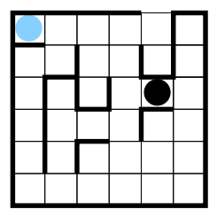
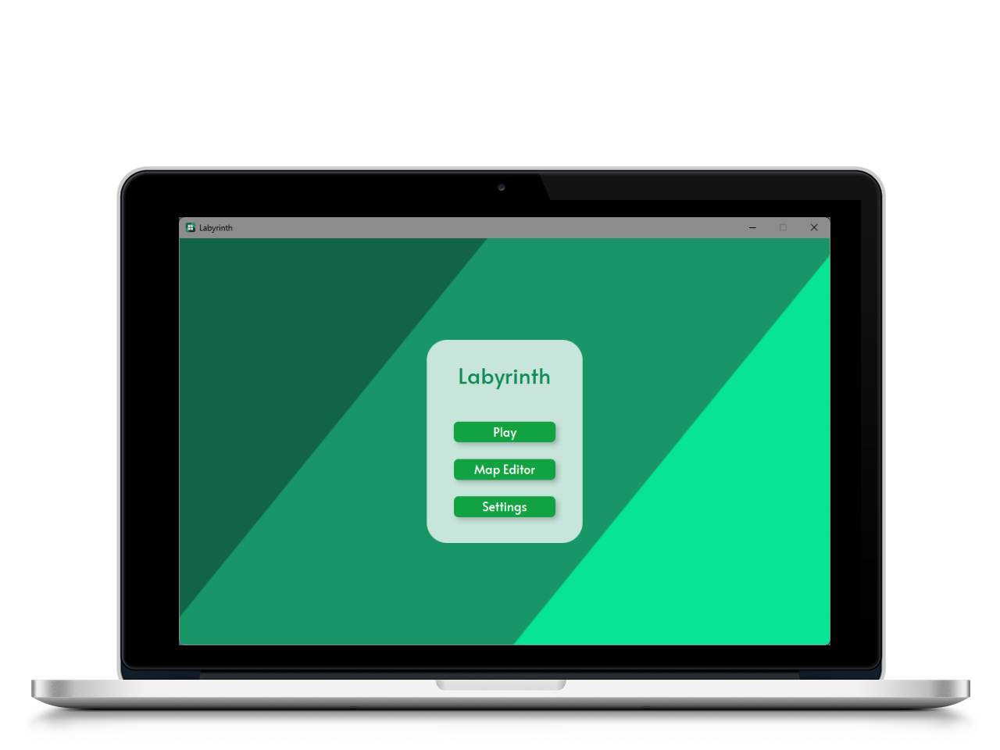

<a href=""></a> 
# Labyrinth [](https://github.com/MrExplode/Labyrinth/actions/workflows/build.yml/) [](https://wakatime.com/@MrExplode)

<br>

<p>
The goal of this game is to escape from a labyrinth, before the monster catches the player. 
In each turn we can move one step horizontally or vertivally. 
Neither the player nor the monster can cross walls. 
After each player move, the monster takes two steps towards the player, preferring horizontal movement.
</p>
<br>
<br>


<h2>Features</h2>
        <ul>
            <li>Map editor</li>
            <li>Language selection</li>
            <li>Highscores</li>
        </ul>

<br>
<br>
<br>

## Building & Usage
You can build the project by running:
```bash
./mvnw package # Linux
mvnw.cmd package # Windows
```
You can find the built artifact in the `labyrinth-ui/target` folder.
```bash
java -jar labyrinth-ui/target/labyrinth-ui-1.0.jar
```

## Site generation
Please note, even though the site generation might seem broken when built locally, it is not [when deployed](https://maven.apache.org/plugins/maven-site-plugin/faq.html#Why_dont_the_links_between_parent_and_child_modules_work_when_I_run_mvn_site).

